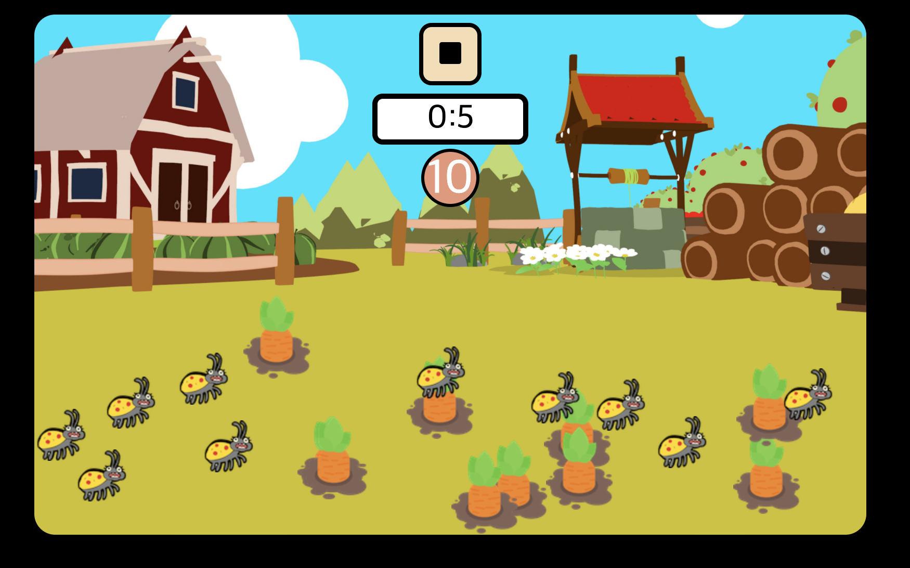

# Carrot-Game

Javascript 문법의 연습을 위해 Carrot Game을 구현시키고 발전시켜 보았다.

---

## Game Screen

## User Manual

- 게임 내 요소

1. 당근 : 당근을 클릭하여 화면 내에 있는 모든 당근들을 제한시간 내에 없애야하는 것이 이 게임의 목표이다.
2. 벌레 : 장애물 요소1이다. 클릭하면 게임에 실패하고 종료된다.
3. 불 : 장애물 요소2이다. 클릭하면 게임에 실패하고 종료된다.

- Stage
  총 6개의 level이 존재한다. 각 level마다 게임 내 요소의 개수들이 다르며 제한시간도 다르도록 설정하였다.

1. Level1: 당근10, 벌레10, 불0, 시간10
2. Level2: 당근10, 벌레10, 불0, 시간7
3. Level3: 당근15, 벌레15, 불0, 시간10
4. Level4: 당근20, 벌레20, 불1, 시간13
5. Level5: 당근20, 벌레 20, 불2, 시간11
6. Level6: 당근23, 벌레20, 불3, 시간10
